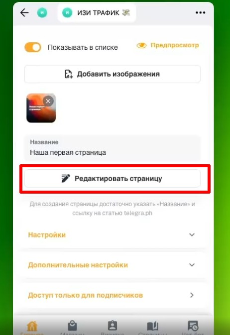

### Как создать страницу

[video:https://drive.google.com/file/d/134ooJROtBig07l90YSYAokivpTOa2hxM/view?usp=sharing:]

### Как включить предварительный просмотр страницы

[video:https://drive.google.com/file/d/1XsWkWy1o0njU-MVVIIs0fb1-ItRo8ggG/view?usp=sharing:]

### Как редактировать созданную страницу

{width=462px height=673px}

### Как скрыть страницу из каталога

:::note 

Все созданные статьи по умолчанию появляются в каталоге товаров (витрине) , возможно вы не захотите, чтобы они там отображались, поэтому скройте их

:::

[video:https://drive.google.com/file/d/1wNaMqGYonhf4PfLsiH68VUZ_F0d6S93j/view?usp=sharing:]

### 