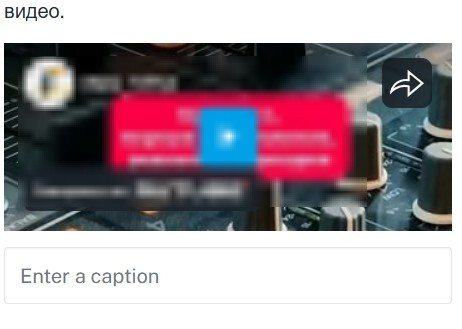

Видео можно вставить из:  ВК, Youtube, Yandex Cloud Video, Kinescope так же поддерживаются VK клипы 

:::info 

Ссылка на видео должна быть доступна всем

:::

1. Берем ссылку на видео

   🔗 Примеры нужных ссылок:

   Вк : <https://vk.com/video365464197_456239724>

   Kinescope: [https://kinescope.io/f53etgfPwh52GDFwVX78Ag](https://kinescope.io/f53eqvbPwh52GRFwVX87Ag)

   Cloud video: [https://runtime.video.cloud.yandex.net/player/video/lbnhmjahc9vznsmisjtr?autoplay=0&mute=0](https://runtime.video.cloud.yandex.net/player/video/vplvmjahc3vzsmnisjtr?autoplay=0&mute=0)

2. Вставляем блок «Параграф»

   [image:./video-na-stranice-3.jpg:::0,4.615384615384616,100,62.56410256410256:::453px:195px:center]

   {width=466px height=129px}

3. Вставляем нашу ссылку на видео. Видео должно встроится на страницу

   {width=462px height=329px}

   :::tip 

   Если видео не встроилось на страницу, скопируйте ссылку в редакторе страниц и еще раз  вставить на страницу

   :::