1. Необходимо вашего бота, сделать администратором в вашем канале/чате, где вы хотите закрепить кнопку, для этого заходим в канал/чат - управление

   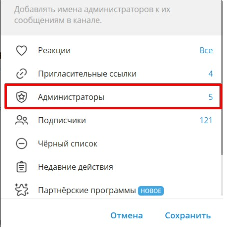{width=452px height=459px}

2. Нажимаем добавить администратора

   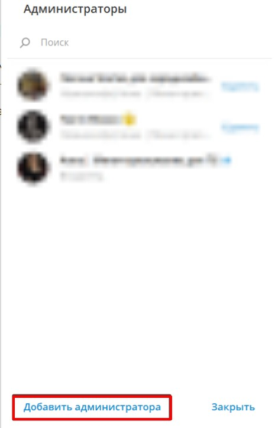{width=465px height=724px}

3. Вводите имя своего бота (@....\_bot), и выбираем его.

   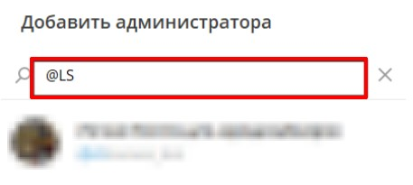{width=457px height=205px}

4. Выдаем права и сохраняем настройки.

   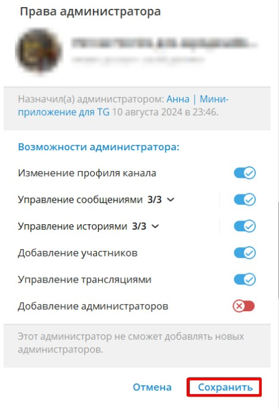{width=468px height=686px}

5. Далее переходим в своего бота, который подключен к Notibot и нажимаем или вводим /pinv

   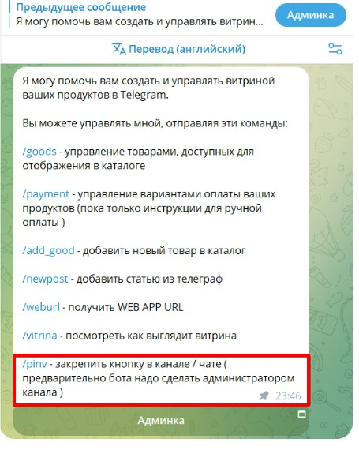{width=455px height=570px}

6. Появляется окно настройками для поста в канале.

   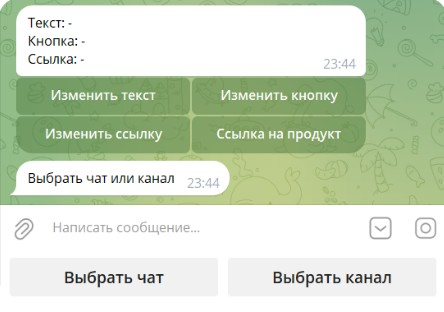{width=444px height=312px}

7. Изменяем текст, который будет закреплен к чате/канале, нажимаем на кнопку Изменить текст

   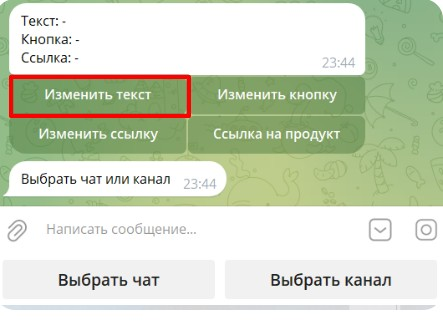{width=443px height=322px}

8. Вводим текст поста и отправляем

   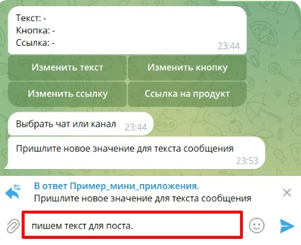{width=440px height=358px}

9. Далее также меняем кнопку и вводим название (Лид-магнит, подарок, открыть)

   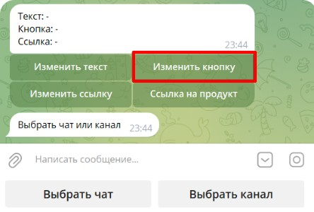{width=444px height=300px}

10. Также меняем ссылку, которая будет зашита в кнопке.

    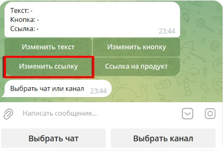{width=447px height=303px}

11. Выбираем чат или канал, где будет закреплен данный пост.

    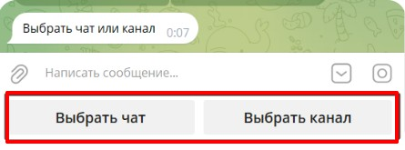{width=445px height=165px}

#### Пример, как будет выглядеть пост в канале или чате

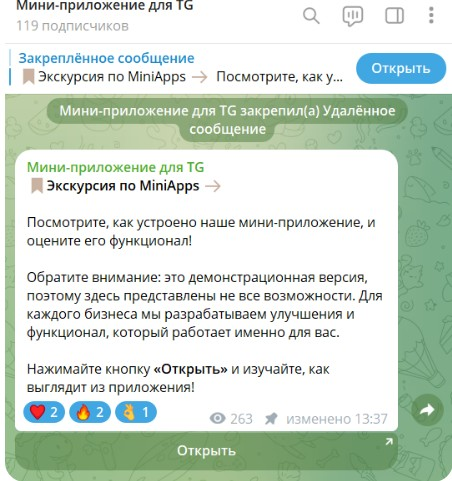{width=452px height=481px}